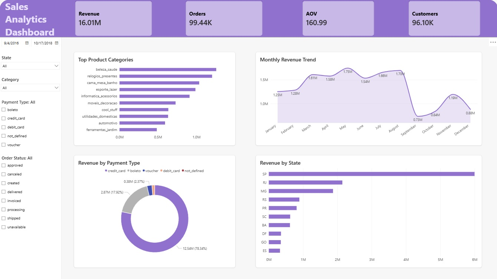

# Sales Analytics Dashboard

This project uses the Olist E-commerce dataset to analyze sales performance and build an interactive data visualization dashboard with Power BI.

The dashboard focuses on 4 main KPIs:
- Revenue
- Orders
- Customers
- AOV
## Tools
- PostgreSQL
- Power BI
## Dataset
The analysis uses 5 main tables:
- Customers
- Orders
- Order Payments
- Order Items
- Products
# Key Insights
## 1. Monthly Revenue Trend
- Revenue reached its highest point around August and then dropped sharply in September.

- This shows that revenue changed significantly over time and needs further analysis to understand the reason behind the decline.
## 2. Top Product Categories
- Some product categories contributed much higher revenue than others.

- The top-performing categories include:

  - Beauty & Health
 
  - Watches & Gifts
 
  - Home & Living
 
- This shows that revenue was mainly concentrated in several key product categories
## 3. Revenue by Payment Type
- Credit card was the payment method with the highest share of total revenue.

- This suggests that most customers preferred paying by credit card.
## 4. Revenue by State
- Sao Paulo (SP) had the highest revenue at around 6M, far ahead of other states.

- Rio de Janeiro (RJ) ranked second with more than 2M, followed by Minas Gerais (MG) with nearly 2M.

- This shows that revenue was mainly concentrated in large states, especially SP, which was the biggest revenue contributor.
